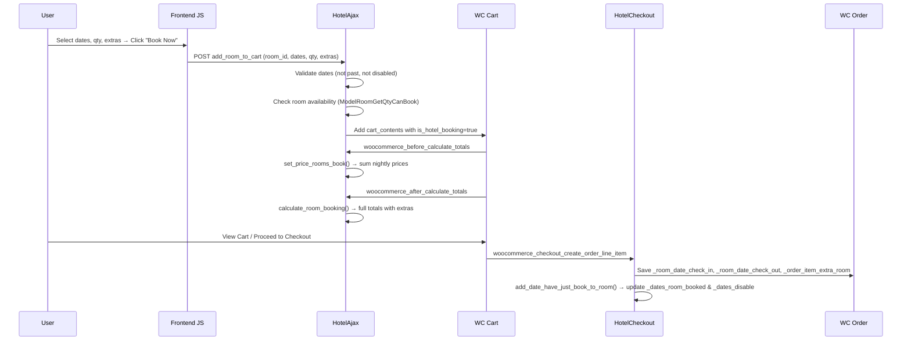

# Hotel Booking Plugin — Architecture & Price Calculation

> Plugin: `wp-content/plugins/hotel-booking/`
> Main file: `hotel-booking-phys.php`
> WooCommerce dependency: Required (deactivates if WC is not active)

---

## 1. Plugin Overview

The **Hotel Booking** plugin by Physcode extends WooCommerce with a custom product type (`hotel_phys`) that represents bookable hotel rooms. Rooms are WooCommerce products with extra metadata for dates, pricing schedules, extras, availability, and location.

### Key Concepts

| Concept | Description |
|---|---|
| **Room** | A WooCommerce product of type `hotel_phys` |
| **Night** | The unit of pricing — each date between check-in and check-out |
| **Price Schedule** | Per-day-of-week pricing within date ranges (overrides base price) |
| **Extras** | Optional add-ons (checkbox or quantity-based) with per-day pricing option |
| **Availability** | Tracked via `_dates_room_booked` and `_total_hotel_room` (max concurrent rooms) |
| **Deposit** | Optional integration with WooCommerce Deposits plugin |

---

## 2. Plugin Architecture

### Bootstrap & Singleton

```
HotelBookingPhys::instance()  (hotel-booking-phys.php)
├── plugin_defines()      → Constants, paths, template paths
├── plugin_init()         → WooCommerce check, includes, hooks
│   ├── includes()        → Load all PHP files
│   ├── includes_backend() → HotelOrder (admin only)
│   └── init_hooks()      → Enqueue scripts, taxonomy, title
```

### File Map

| File | Class | Responsibility |
|---|---|---|
| `hotel-booking-phys.php` | `HotelBookingPhys` | Main bootstrap, singleton, defines, asset loading, taxonomy registration |
| `inc/ProductTypeHotel.php` | `WC_Product_Hotel_Phys` | Registers custom WC product type `hotel_phys`, admin menu, product tabs |
| `inc/TabHotel.php` | `TabHotel` | WC product data tabs (Hotel Booking, Dates Price, Room Booked, Location) and save logic |
| `inc/HotelAjax.php` | `HotelAjax` | **Core price calculation**, add-to-cart, cart totals (WC < 3.2), extras pricing |
| `inc/class-phys-cart-totals.php` | `Phys_Hotel_Cart_Totals` | Custom cart totals for WC ≥ 3.2 (replaces `WC_Cart_Totals`) |
| `inc/HotelCheckout.php` | `HotelCheckout` | Saves booking metadata to WC order items, updates room availability |
| `inc/HotelOrder.php` | `HotelOrder` | Admin order display, refund handling, availability restoration |
| `inc/HotelRoomFunction.php` | `HotelRoomFunction` | Utilities: nights calc, date conversion, availability, price formatting |
| `inc/HotelSetting.php` | `HotelSetting` | WooCommerce Settings → Hotel tab (General, Extras, Single Hotel, Permalink) |
| `inc/HotelQuery.php` | `HotelQuery` | Custom queries for room search/archive pages |
| `inc/HotelUrl.php` | `HotelUrl` | URL rewriting for hotel pages |
| `inc/HotelShortcode.php` | `HotelShortcode` | Shortcodes for displaying rooms |
| `inc/HotelTemplateLoader.php` | `HotelTemplateLoader` | Template overrides for frontend |
| `inc/Model/ModelRoomGetQtyCanBook.php` | `ModelRoomGetQtyCanBook` | Data model for availability check inputs |
| `inc/class-hotel-review-room.php` | — | Hotel review/rating system with image uploads |
| `inc/external-plugin/class-wpml.php` | — | WPML compatibility |
| `inc/external-plugin/class-polylang.php` | — | Polylang compatibility |

---

## 3. Room Product Metadata (`post_meta`)

Each room (WC product of type `hotel_phys`) stores these meta fields:

| Meta Key | Description | Format |
|---|---|---|
| `_phys_hotel_regular_price` | Regular price per night | float |
| `_phys_hotel_sale_price` | Sale price per night | float |
| `_total_hotel_room` | Total number of rooms available | int |
| `_room_number_adults` | Max adults per room | int |
| `_room_number_children` | Max children per room | int |
| `_dates_room_booked` | JSON array of all bookings | `[{start_date, end_date, qty_room, order}]` |
| `_dates_disable` | JSON array of fully-booked dates | `["2024-01-15", "2024-01-16", ...]` |
| `_hotel_extras_room` | Room-specific extras config | JSON |
| `_price_room_schedule` | **Day-of-week price overrides** within date ranges | JSON (see below) |
| `_phys_room_starts_after` | Minimum days before check-in | int |
| `_phys_room_dates_disable` | Manually disabled dates | JSON |
| `_hotel_address` | Hotel address | string |
| `_hotel_lat` / `_hotel_long` | Lat/Long for Google Maps | float |
| `_hotel_phone` / `_hotel_email` | Contact info | string |
| `_google_map_iframe` | Embedded Google Maps iframe | HTML |

### Price Room Schedule Format

```json
[
  {
    "start_date": "2024-06-01",
    "end_date": "2024-08-31",
    "Monday": 120,
    "Tuesday": 120,
    "Wednesday": 130,
    "Thursday": 130,
    "Friday": 150,
    "Saturday": 180,
    "Sunday": 160
  }
]
```

---

## 4. Price Calculation — How It Works

The price calculation is the **most complex part** of the plugin. It happens across multiple hooks and classes.

### 4.1 Step 1 — Set Price Per Room on Cart Items

**Hook:** `woocommerce_before_calculate_totals` → `HotelAjax::set_price_rooms_book()`

For each hotel cart item, this method:

1. Gets the **check-in** and **check-out** dates from the cart item
2. Generates an array of **all nights** between them via `HotelRoomFunction::get_nights_book()`
3. For **each night**, determines the price:
   - Checks if the night falls within a **price schedule** date range (`_price_room_schedule`)
   - If yes → uses the **day-of-week price** from that schedule (e.g., `Monday: 120`)
   - If the day-of-week price is `0` → falls back to the **default product price**
   - If no schedule matches → uses the **default product price** (`$product->get_price()`)
4. **Sums all nightly prices** to get the total room price
5. Calls `$product->set_price($total_price)` — this sets the per-unit price on the WC product object so WooCommerce uses it for subsequent calculations

**Formula:**
```
Room Price = Σ (price for each night between check-in and check-out)
```

Where `price for night` = schedule price if exists, else default price.

### 4.2 Step 2 — Add Extras to Line Price

**Method:** `HotelAjax::add_price_extras_room($price, $qty, $cart_item)`

Called during cart totals calculation. For each extra attached to the room:

| Extra Type | Calculation |
|---|---|
| `qty` type | `qty_selected × extra_price × (total_nights if per_day enabled)` |
| `checkbox` type | `extra_price × room_qty × (total_nights if per_day enabled)` |

The extras total is added to the line price in WC precision format (`wc_add_number_precision_deep()`).

**Formula:**
```
Line Price = (Room Price × Quantity) + Σ Extras
```

### 4.3 Step 3 — Cart Totals Calculation

Depends on WooCommerce version:

#### WooCommerce < 3.2 (Legacy)

**Hook:** `woocommerce_after_calculate_totals` → `HotelAjax::calculate_room_booking()`

Completely replaces WC's cart calculation:

1. Resets all cart totals
2. Iterates cart items, applies `add_price_extras_room()` to line prices
3. Calculates tax (inclusive/exclusive/adjusted for location)
4. Applies coupon discounts
5. Calculates shipping, fees, grand total

#### WooCommerce ≥ 3.2 (Modern)

**Class:** `Phys_Hotel_Cart_Totals` (extends nothing but mirrors `WC_Cart_Totals` logic)

Instantiated in `calculate_room_booking()` when WC ≥ 3.2:
```php
new Phys_Hotel_Cart_Totals($cart_object);
```

Calculation flow:
```
calculate()
├── calculate_item_totals()
│   ├── get_items_from_cart()     → Builds item list, applies extras via add_price_extras_room()
│   ├── calculate_item_subtotals() → Tax calculation per item
│   └── calculate_discounts()     → Coupon processing
├── calculate_shipping_totals()
├── calculate_fee_totals()
└── calculate_totals()            → Grand total = items + fees + shipping + taxes
```

Key customization in `get_items_from_cart()` (lines 233-238):
```php
$line_price = wc_add_number_precision_deep($cart_item['data']->get_price()) * $cart_item['quantity'];
$line_price = HotelAjax::add_price_extras_room($line_price, $cart_item['quantity'], $cart_item);
$item->subtotal = $line_price;
```

### 4.4 Subtotal Display

**Hook:** `woocommerce_cart_item_subtotal` → `HotelAjax::update_subtotal()`

Uses `HotelRoomFunction::hotel_format_price($cart_item['line_subtotal'])` to display the subtotal with the hotel's own price formatting.

### 4.5 Tour/Children Price (Static Methods)

`Phys_Hotel_Cart_Totals::get_price_for_child_on_tour()`:
- Checks day-of-week children price from `_price_each_day` meta
- Falls back to `_price_child` per-room meta
- Falls back to percentage of adult price from global option `price_children`

### 4.6 Deposit Calculation

**Hook:** `wc_deposits_cart_item_deposit_data` → `HotelAjax::calculate_cart_item_deposit()`

For rooms with deposits enabled:
- Uses `Phys_Hotel_Cart_Totals::get_subtotal_item_tour()` to get the full subtotal (including extras)
- If deposit type is `percent`: `deposit = subtotal × amount / 100`

---

## 5. Booking Flow (End-to-End)



---

## 6. Availability System

### How Availability is Tracked

Each room has:
- `_total_hotel_room`: Maximum concurrent rooms bookable (e.g., `5`)
- `_dates_room_booked`: JSON array of all bookings `[{start_date, end_date, qty_room, order}]`
- `_dates_disable`: JSON array of dates where all rooms are booked

### Availability Check Logic (`HotelRoomFunction::calculate_qty_can_book()`)

1. Get all booked date ranges for the room
2. For each booked date range, expand into individual nights
3. Sum `qty_room` per night across all bookings
4. Find the night with the **maximum** booked quantity within the requested range
5. **Available rooms** = `total_hotel_room - max_booked_qty`

### When Availability Updates

| Event | Action |
|---|---|
| **Order placed** | `HotelCheckout::add_date_have_just_book_to_room()` — adds booking to `_dates_room_booked`, recalculates `_dates_disable` |
| **Order refunded** | `HotelOrder::hotel_order_refunded()` — reduces qty or removes booking, recalculates `_dates_disable` |
| **Order cancelled** | `HotelOrder::hotel_order_change_status()` — removes booking, recalculates `_dates_disable` |
| **Room saved in admin** | `TabHotel::save_all_field_hotel_custom_phys()` — recalculates `_dates_disable` with new `_total_hotel_room` |

---

## 7. Admin Hooks & Settings

### WooCommerce Settings Tab

Located at **WooCommerce → Settings → Hotel** with sections:

| Section | Options |
|---|---|
| **General** | Rooms page, redirect after booking, location option, Google API key, date format, debug mode |
| **Extras Rooms** | Global extras definitions (name, type, price, per-day toggle) |
| **Single Hotel** | Review popup enable, max images, max file size |
| **Permalink Hotel** | Hotel category base slug |

### Product Data Tabs (Admin)

When product type = `hotel_phys`, these tabs appear:

| Tab | Template | Purpose |
|---|---|---|
| Hotel Booking | `metabox-hotel-booking.php` | Price, room count, adults/children, extras |
| Hotel Dates Price | `metabox-hotel-dates-price.php` | Price schedules, starts-after, disabled dates |
| Manager dates Room Booked | `metabox-hotel-dates-room-booked.php` | View/manage bookings, export iCal/CSV |
| Hotel Location | `metabox-hotel-location.php` | Address, phone, email, lat/long, Google Maps |

Tabs hidden for hotel type: General, Shipping, Linked Product, Advanced.

---

## 8. WooCommerce Integration Points

| WC Hook | Plugin Method | Purpose |
|---|---|---|
| `plugins_loaded` | `register_product_type_hotel_phys()` | Register `WC_Product_Hotel_Phys` class |
| `product_type_selector` | `add_type_flight_phys_to_product()` | Show "Hotel" in product type dropdown |
| `woocommerce_before_calculate_totals` | `HotelAjax::set_price_rooms_book()` | Set dynamic nightly price sum |
| `woocommerce_after_calculate_totals` | `HotelAjax::calculate_room_booking()` | Override cart totals with extras |
| `woocommerce_cart_item_subtotal` | `HotelAjax::update_subtotal()` | Custom subtotal display |
| `woocommerce_stock_amount_cart_item` | `HotelAjax::update_cart_action_cart_update()` | Enforce availability on qty update |
| `woocommerce_checkout_create_order_line_item` | `HotelCheckout::add_order_item_line()` | Save booking meta to order |
| `woocommerce_order_refunded` | `HotelOrder::hotel_order_refunded()` | Restore availability on refund |
| `woocommerce_before_order_object_save` | `HotelOrder::hotel_order_change_status()` | Restore availability on cancel |
| `wc_deposits_cart_item_deposit_data` | `HotelAjax::calculate_cart_item_deposit()` | Custom deposit calculation |

---

## 9. Cart Item Data Structure

When a room is added to cart, the cart item contains:

```php
[
    'key'                 => 'cart_item_key',
    'product_id'          => 123,
    'is_hotel_booking'    => true,          // Flag to identify hotel items
    'quantity'            => 2,             // Number of rooms
    'room_date_check_in'  => '2024-07-01',  // Y-m-d format
    'room_date_check_out' => '2024-07-05',  // Y-m-d format
    'variation_id'        => 0,
    'variation'           => 0,
    'data'                => WC_Product,     // Product object (price modified dynamically)
    'data_hash'           => '...',
    'extras_room'         => '{"extra1": {"type": "qty", "qty": 2}}',  // Optional
    'order_item_extra_room' => '...',       // Processed extras with prices
    'deposit'             => ['enable' => 'yes'],  // Optional, if WC Deposits active
]
```

---

## 10. Key Filters & Actions for Customization

| Hook | Type | Description |
|---|---|---|
| `fields_tab_hotel_booking` | Filter | Modify list of room meta fields |
| `hotel_booking_phys_script_localize_array` | Filter | Add data to frontend JS global |
| `hotel_settings_metabox_phys` | Filter | Modify settings fields |
| `hotel_format_price_phys` | Filter | Customize price HTML output |
| `hotel_template_path_override` | Filter | Override template directory |
| `title_page_hotel` | Filter | Customize hotel page title |
| `phys_header_hotel_export_csv` | Filter | Customize CSV export headers |
| `hotel_booking_before_calculate_totals` | Action | Before cart calculation (WC < 3.2) |
| `hotel_booking_after_calculate_totals` | Action | After cart calculation (WC < 3.2) |

---

## 11. Price Calculation Example

**Scenario:** Book 2 rooms from July 1–4, 2024 (3 nights), with breakfast extra ($15/night).

**Step 1: Nightly Price Calculation** (`set_price_rooms_book`)

| Night | Day | Schedule Price | Effective Price |
|---|---|---|---|
| 2024-07-01 | Monday | $120 | $120 |
| 2024-07-02 | Tuesday | $120 | $120 |
| 2024-07-03 | Wednesday | $0 (not set) | $100 (default) |

**Total room price** = $120 + $120 + $100 = **$340** (set on product object)

**Step 2: Line Price with Extras** (`add_price_extras_room`)

- Room line: $340 × 2 rooms = $680
- Breakfast (checkbox, per_day): $15 × 2 rooms × 3 nights = $90
- **Total line price** = $680 + $90 = **$770**

**Step 3: Cart Totals** (`Phys_Hotel_Cart_Totals`)

- Items total: $770
- Tax (e.g., 10%): $77
- Shipping: $0 (digital)
- **Grand total** = $847
