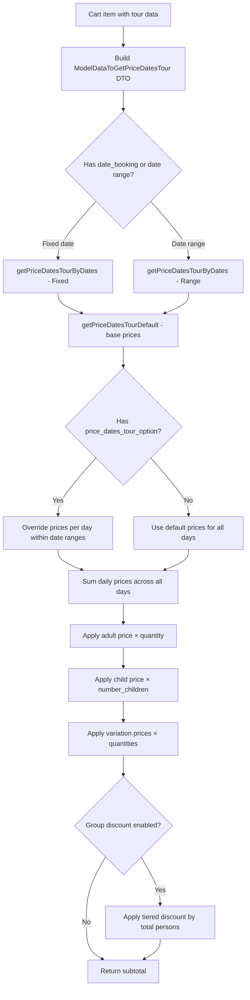
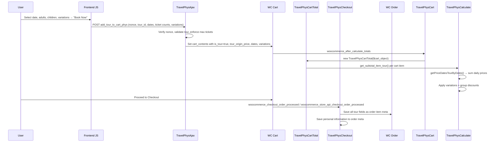

# Travel Booking Plugin — Architecture & Price Calculation

> Plugin: `wp-content/plugins/travel-booking/`
> Main file: `travel-booking.php`
> WooCommerce dependency: Required (`Requires Plugins: woocommerce`)

---

## 1. Plugin Overview

The **Travel Booking** plugin by Physcode extends WooCommerce with a custom product type (`tour_phys`) for bookable tours. Tours support **fixed-date booking** or **date-range booking**, adult/child pricing, custom variations (select/checkbox/radio/quantity), date-range price overrides, group discounts, and personal information collection at checkout.

### Key Concepts

| Concept | Description |
|---|---|
| **Tour** | A WooCommerce product of type `tour_phys` |
| **Fixed-date booking** | Single `date_booking` — tour has a set duration (`_phys_tour_duration_number`) |
| **Date-range booking** | `date_check_in` + `date_check_out` — price accumulated per day |
| **Variation** | Custom add-ons (select, checkbox, radio, quantity) with optional pricing |
| **Price Dates Option** | Date-range price overrides for adult, child, and each variation attribute |
| **Group Discount** | Tiered discount by total person count (% or flat amount) |
| **Deposit** | Integration with WooCommerce Deposits (official + Webtomizer + Acowebs AWCDP) |

---

## 2. Plugin Architecture

### Bootstrap & Singleton

```
TravelBookingPhyscode::instance()  (travel-booking.php)
├── plugin_defines()    → Constants, paths (TOUR_BOOKING_PHYS_PATH, TB_PHYS_PRODUCT_TYPE)
├── includes()          → WooCommerce check, load all PHP files
│   ├── Frontend-only:  TravelPhysCalculate, TravelPhysCart, TravelPhysAjax,
│   │                   TravelPhysCartTotal, TravelPhysCheckout, Deposit plugins
│   └── Always:         TravelPhysOrder, TravelPhysReviewTour, SEO, WPML, Currency
└── hooks()             → Taxonomy, SEO, Elementor, enqueue scripts
    └── init_hook()     → TravelPhysUtility, TravelPhysVariation, TravelPhysFaq,
                          TravelPhysHighlight, TravelPhysTab
```

### File Map

| File | Class | Responsibility |
|---|---|---|
| `travel-booking.php` | `TravelBookingPhyscode` | Main bootstrap, singleton, asset loading, SEO wrappers |
| `inc/product-type-tour.php` | `WC_Product_Tour_Phys` | Registers WC product type `tour_phys` |
| `inc/class-travel-calculate.php` | `TravelPhysCalculate` | **Core price engine** — date-range pricing, variations, group discounts |
| `inc/class-travel-cart-totals.php` | `TravelPhysCartTotal` | Custom cart totals (replaces `WC_Cart_Totals`) |
| `inc/class-travel-cart.php` | `TravelPhysCart` | Cart display (name, price, quantity, subtotal) |
| `inc/class-travel-ajax.php` | `TravelPhysAjax` | Add-to-cart handler with nonce validation |
| `inc/class-travel-checkout.php` | `TravelPhysCheckout` | Order metadata saving (classic + block checkout), personal info |
| `inc/class-travel-order.php` | `TravelPhysOrder` | Admin order display, order item meta rendering |
| `inc/class-travel-variation.php` | `TravelPhysVariation` | Variation system (select/checkbox/radio/quantity types) |
| `inc/class-travel-settings.php` | `Tour_Settings_Tab_Phys` | WooCommerce Settings → Tour tab |
| `inc/class-travel-tab-tour.php` | `TravelPhysTab` | Admin product data tabs and meta fields |
| `inc/class-travel-utility.php` | `TravelPhysUtility` | Date conversion, formatting, utilities |
| `inc/class-travel-query.php` | `TravelPhysQuery` | Custom queries for tour archive/search |
| `inc/class-travel-url.php` | `TravelPhysUrl` | URL rewriting for tour pages |
| `inc/class-travel-review-tour.php` | `TravelPhysReviewTour` | Tour review/rating with image uploads |
| `inc/class-travel-faq.php` | `TravelPhysFaq` | FAQ tab for tours |
| `inc/class-travel-hightlight.php` | `TravelPhysHighlight` | Highlights tab for tours |
| `inc/class-travel-tour-type-meta.php` | — | Tour type taxonomy custom meta |
| `inc/class-travel-template-loader.php` | — | Template override loader |
| `inc/class-travel-tour-search.php` | — | Tour search widget |
| `inc/model/ModelDataToGetPriceDatesTour.php` | `ModelDataToGetPriceDatesTour` | DTO for price calculation inputs |

---

## 3. Price Calculation — How It Works (`class-travel-calculate.php`)

The price calculation is the core of the plugin. It happens in `TravelPhysCalculate` via the method `get_subtotal_item_tour()`.

### 3.1 The Price Calculation Flow



### 3.2 Step 1 — Build Default Prices (`getPriceDatesTourDefault`)

Creates base price object from:
- `regular_price` → `regular_price_dates` (adult per-day price)
- `child_price` → `child_price_dates` (child per-day price)
- For each variation with `set_price == 1`: gets attribute prices from `_tour_variations_options`

### 3.3 Step 2 — Apply Date-Range Overrides (`getPriceDatesTourByDates`)

Two modes:

#### Fixed Date Mode (`date_booking` set)
- Converts `date_booking` to a date range using `_phys_tour_duration_number`
- If duration > 1: `check_out = check_in + duration days`
- Iterates each day, checks if day falls within any `price_dates_range`
- If within range and override price > 0: uses override price; else uses default

#### Date Range Mode (`date_check_in` + `date_check_out`)
- Iterates each day from check-in to check-out
- Same override logic as fixed-date mode
- Accumulates daily prices across the entire range

### Price Dates Option Format (`_phys_price_of_dates_option`)

```json
{
  "price_dates_range": {
    "1582087337976": {
      "start_date": "2024/06/01",
      "end_date": "2024/08/31",
      "prices": {
        "regular_price_dates": { "label": "Regular Price", "price": "150" },
        "child_price_dates": { "label": "Child Price", "price": "80" },
        "1582079716806": {
          "1582079716806": { "label": "Airport Transfer", "price": "50" }
        }
      }
    }
  }
}
```

### 3.4 Step 3 — Calculate Subtotal (`get_subtotal_item_tour`)

```php
foreach ($price_dates_tour as $k_price => $v_price) {
    if ($k_price == 'regular_price_dates') {
        // Adult: price × quantity (adults)
        $subtotal += wc_add_number_precision($v_price * $quantity);
    } elseif ($k_price == 'child_price_dates') {
        // Child: price × number_children
        $subtotal += wc_add_number_precision($v_price * $number_children);
    } else {
        // Variation: price × variation_quantity
        foreach ($v_price as $k_attr => $v_attr) {
            $quantity_attr = $cart_item['tour_variations']->{$k_price}->{$k_attr}->quantity ?? 1;
            $subtotal += wc_add_number_precision($v_attr * $quantity_attr);
        }
    }
}
```

### 3.5 Step 4 — Group Discount

If `_tour_group_discount_enable == 1`:

```json
[
  { "number_customer": 5, "discount": "10%" },
  { "number_customer": 10, "discount": "50" }
]
```

- Total persons = adults + children
- Finds the highest tier where `number_customer <= total_persons`
- If discount ends with `%`: `subtotal = subtotal - (subtotal × discount / 100)`
- If flat amount: `subtotal = subtotal - discount`

---

## 4. Booking Flow (End-to-End)



---

## 5. Cart Item Data Structure

When a tour is added to cart:

```php
[
    'product_id'               => 456,
    'is_tour'                  => true,
    'key'                      => 'cart_item_key',
    'variation_id'             => 0,
    'variation'                => 0,
    'data'                     => WC_Product,        // Product object (price modified dynamically)
    'tour_origin_price'        => 100,               // Original product price (before date calc)
    'quantity'                 => 3,                  // Number of adult tickets

    // Fixed-date mode:
    'date_booking'             => '2024/07/01',
    'tour_date_end'            => '2024/07/03',

    // OR date-range mode:
    'date_check_in'            => '2024/07/01',
    'date_check_out'           => '2024/07/05',

    // Children:
    'number_children'          => 2,
    'price_children'           => 80,                // Set during calculation

    // Variations:
    'tour_variations'          => { ... },            // JSON object of selected variations
    'tour_variations_options'  => { ... },            // Full variation config from DB

    // Computed during calculation:
    'price_dates_tour'         => { ... },            // Price object from TravelPhysCalculate
    'tour_group_discount'      => '<strong>Group discount</strong>: 10% (5 People)',
    'price_dates_tour_option'  => { ... },            // Date-range price overrides
]
```

---

## 6. Variation System

### Variation Types

| Type | Behavior | Price Impact |
|---|---|---|
| `select` | Dropdown selection | Single selection, adds price if `set_price=1` |
| `checkbox` | Toggle on/off | Adds price if checked and `set_price=1` |
| `radio` | Single selection from group | Adds price of selected option |
| `quantity` | Numeric input | `price × quantity` if `set_price=1` |

### Variation Option Structure (`_tour_variations_options` meta)

```json
{
  "1582079716806": {
    "label_variation": "Transport",
    "enable": "1",
    "type_variation": "checkbox",
    "set_price": "1",
    "required": "0",
    "variation_attr": {
      "1582079716806": { "label": "Airport Transfer", "price": "50", "des": "" }
    }
  },
  "1581998465087": {
    "label_variation": "Vehicle",
    "enable": "1",
    "type_variation": "quantity",
    "set_price": "1",
    "required": "0",
    "variation_attr": {
      "1582079658779": { "label": "Car", "price": "100", "des": "" },
      "1581998465087": { "label": "Bicycle", "price": "30", "des": "" }
    }
  }
}
```

---

## 7. External Plugin Integrations

| Plugin | File | Integration |
|---|---|---|
| **WooCommerce Deposits** (official) | `class-woocommerce-deposits.php` | Custom deposit calculation for tour subtotals |
| **Webtomizer Deposits** | `class-webtomizer-deposit.php` | Alternative deposits plugin support |
| **AWCDP Deposits** (Acowebs) | `class-awcdp-deposits.php` | Partial payments for tours |
| **Yoast SEO** | `class-seo-yoast.php` | Title/description/OG overrides for tour archive |
| **Rank Math** | `class-seo-rankmath.php` | Title/description/OG overrides for tour archive |
| **SEO Integration** | `class-seo-integration.php` | Provider-agnostic SEO gateway |
| **WPML** | `class-wpml.php` | Multilingual tour support |
| **Polylang** | `class-polylang.php` | Multilingual tour support |
| **WooCommerce Currency Switcher** | `class-woo-currency-switcher.php` | Multi-currency price conversion |
| **PDF Invoices & Packing Slips** | `class-woo-pdf-invoices-packing-slips.php` | Invoice customization |
| **Elementor** (via Thim_EL_Kit) | `elementor/TourElementor.php` | Elementor widgets for tours |

### Deposit Detection Logic

```php
$deposit_author = TravelPhysWoocommerceDeposits::getInstance()->get_active_plugin();
// Returns: 'official' | 'webtomizer' | null
```

---

## 8. WooCommerce Integration Points

| WC Hook | Plugin Method | Purpose |
|---|---|---|
| `plugins_loaded` | `register_product_type_tour_phys()` | Register `WC_Product_Tour_Phys` class |
| `woocommerce_after_calculate_totals` | `TravelPhysCart::update_price_for_tour()` | Trigger custom cart totals via `TravelPhysCartTotal` |
| `woocommerce_cart_item_name` | `TravelPhysCart::html_cart_tour()` | Custom cart item name with dates, variations, discounts |
| `woocommerce_cart_item_price` | `TravelPhysCart::html_cart_tour_price()` | Show adult/child price breakdown |
| `woocommerce_cart_item_quantity` | `TravelPhysCart::html_cart_tour_quantity()` | Add children quantity input |
| `woocommerce_cart_item_subtotal` | `TravelPhysCart::update_subtotal()` | Custom subtotal display |
| `woocommerce_checkout_order_processed` | `TravelPhysCheckout::add_order_item_meta_classic()` | Save tour meta (classic checkout) |
| `woocommerce_store_api_checkout_order_processed` | `TravelPhysCheckout::add_order_item_meta_store_api()` | Save tour meta (block checkout) |
| `woocommerce_checkout_order_created` | `TravelPhysCheckout::add_order_item_meta_deposit()` | Save tour meta for deposit orders |
| `woocommerce_checkout_cart_item_quantity` | `TravelPhysCheckout::html_review_order_tour()` | Custom checkout review display |
| `woocommerce_hidden_order_itemmeta` | `TravelPhysOrder::remove_order_item_meta_fields_backend()` | Hide raw meta from admin |
| `woocommerce_before_order_itemmeta` | `TravelPhysOrder::show_booking_date_order_phys_backend()` | Show tour details in admin order |
| `woocommerce_order_item_meta_end` | `TravelPhysOrder::html_order_tour_item_info()` | Show tour details in customer order |
| `woocommerce_add_to_cart_validation` | *(custom via action)* | Tour validation before add to cart |

---

## 9. Order Item Meta Fields

Saved via `TravelPhysCheckout::add_order_item_meta_data()`:

| Meta Key | Description |
|---|---|
| `_is_tour` | Flag to identify tour items |
| `_date_booking` | Fixed-date booking date |
| `_tour_date_end` | Fixed-date booking end date |
| `_date_check_in` | Date-range check-in |
| `_date_check_out` | Date-range check-out |
| `_tour_variations` | Selected variation data (JSON) |
| `_tour_variations_options` | Full variation config (JSON) |
| `_price_dates_tour` | Computed prices per component (JSON) |
| `_tour_group_discount` | Group discount label (HTML string) |
| `_number_children` | Count of children |
| `_price_children` | Computed child price |
| `_price_adults` | Computed adult price |

---

## 10. Price Calculation Example

**Scenario:** 3-day tour, 2 adults + 1 child, with airport transfer checkbox variation.

**Tour Setup:**
- Base price: $100/day (adult), $60/day (child)
- Summer override (Jun–Aug): $130/day (adult), $80/day (child), $65 airport transfer
- Airport transfer default: $50
- Group discount: 5+ people → 10%

**Step 1: Date-Range Price Accumulation** (Jul 1–3, 3 days in summer)

| Day | Adult | Child | Airport Transfer |
|---|---|---|---|
| Jul 1 | $130 | $80 | $65 |
| Jul 2 | $130 | $80 | $65 |
| Jul 3 | $130 | $80 | $65 |
| **Total** | **$390** | **$240** | **$195** |

**Step 2: Apply Quantities**

- Adults: $390 × 2 = $780
- Children: $240 × 1 = $240
- Airport Transfer (checkbox, qty=1): $195 × 1 = $195
- **Subtotal** = $1,215

**Step 3: Group Discount**

- Total persons = 2 + 1 = 3 (below 5-person threshold)
- No discount applied

**Final Subtotal** = **$1,215**

---

## 11. Key Filters & Actions for Customization

| Hook | Type | Description |
|---|---|---|
| `price_dates_tour_default_phys` | Filter | Modify default price object |
| `price_dates_tour_phys` | Filter | Modify final price after date-range calculation |
| `get_subtotal_item_tour_phys` | Filter | Modify computed subtotal |
| `travel_booking_script_localize_array` | Filter | Add data to frontend JS global |
| `fields_tab_tour_booking` | Filter | Modify tour meta fields |
| `fields_tour_order_phys` | Filter | Modify order item meta fields |
| `tour_variation_item_structure_fields` | Filter | Modify variation structure |
| `html_tour_variation_detail_phys` | Filter | Modify variation display HTML |
| `html_tour_group_discount` | Filter | Modify group discount display |
| `html_check_in_cart` / `html_check_out_cart` | Filter | Modify date display in cart |
| `handle_add_tour_to_cart_set_data_phys` | Action | Add custom data when adding to cart |
| `travel_booking_allowed_tb_ajax_actions` | Filter | Whitelist additional AJAX actions |
| `tb_show_date_book` | Filter | Toggle date booking field visibility |
| `phys/travel/tour_variations_options_obj` | Filter | Modify variation options from DB |

---

## 12. Comparison with Hotel Booking Plugin

| Feature | Hotel Booking | Travel Booking |
|---|---|---|
| Product Type | `hotel_phys` | `tour_phys` |
| Pricing Model | Per-night with day-of-week schedules | Per-day with date-range overrides |
| Date Input | Check-in + Check-out | Fixed date OR Check-in + Check-out |
| Add-ons | Room Extras (checkbox/qty) | Variations (select/checkbox/radio/qty) |
| Persons | Adults only (qty = rooms) | Adults + Children with separate pricing |
| Group Discount | ❌ | ✅ (% or flat, tiered by person count) |
| Availability | Tracked via `_dates_room_booked` | Not tracked (no inventory system) |
| Deposit | WC Deposits (basic) | WC Deposits (official + Webtomizer + AWCDP) |
| SEO | ❌ | ✅ (Yoast, Rank Math, core) |
| Checkout | Classic only | Classic + Block checkout |
| Personal Info | ❌ | ✅ (custom fields per person) |
| Currency Switcher | ❌ | ✅ |
| Cart Totals Class | `Phys_Hotel_Cart_Totals` | `TravelPhysCartTotal` |
| Price Engine | `HotelAjax::set_price_rooms_book()` | `TravelPhysCalculate::getPriceDatesTourByDates()` |
